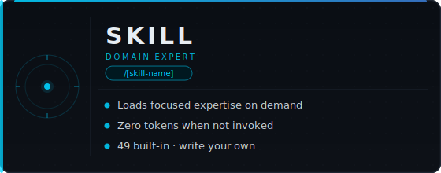
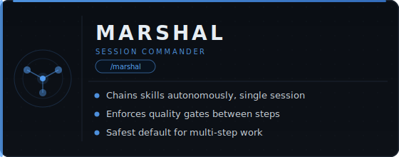

<div align="center">

[](LICENSE)
[](https://nodejs.org/)
[](https://docs.anthropic.com/en/docs/claude-code)
[](https://github.com/openai/codex)
[](https://sethgammon.github.io/Citadel/)

*Stop re-explaining your codebase every session. Start compounding what your agents learn.*

---

**[Follow on X](https://x.com/SethGammon)** for releases and updates · **[Join the discussion](https://github.com/SethGammon/Citadel/discussions)** · **[Watch releases](https://github.com/SethGammon/Citadel/releases)** to get notified

*Building something with Citadel? [Drop a note in Discussions](https://github.com/SethGammon/Citadel/discussions) — use cases, questions, what's broken, what to build next.*

---

</div>

## What Is Citadel

An agent orchestration harness for Claude Code and OpenAI Codex. It coordinates multiple AI agents in parallel, persists memory across sessions, and routes your intent to the cheapest execution path automatically. Citadel adapts itself to each runtime: plugin-first for Claude Code, generated project artifacts plus Codex-native config for Codex.

## Why Citadel Exists

**Without Citadel**, every agent session starts from zero. You re-explain architecture decisions. You re-discover that the auth module is fragile. You copy-paste the same review checklist. When a task is too big for one agent, you manually split it and lose context between the pieces. Your agents never get better at your codebase — you just get better at prompting them.

**With Citadel**, sessions resume where they left off. A `/do review` runs a structured 5-pass review that remembers what broke last time. A `/do overhaul the API layer` spawns parallel agents in isolated worktrees, shares discoveries between them, and merges the results. Skills you build once compound across every future session. The system learns from its own mistakes through campaign persistence and telemetry.

The difference: `CLAUDE.md` and `AGENTS.md` tell the runtime about your project. Citadel gives the runtime the *infrastructure to work autonomously* — routing, memory, safety hooks, and coordination that a single guidance file can't provide.

## Quickstart

**Prerequisites:** [Claude Code](https://docs.anthropic.com/en/docs/claude-code) or [Codex](https://github.com/openai/codex) + [Node.js 18+](https://nodejs.org/)

```bash
# 1. Clone Citadel
git clone https://github.com/SethGammon/Citadel.git

# 2a. Claude Code runtime
claude --plugin-dir /path/to/Citadel

# 2b. Codex runtime
node /path/to/Citadel/scripts/codex-compat.js
node /path/to/Citadel/scripts/install-hooks-codex.js
codex

# 3. In either runtime, run setup
/do setup

# 4. Try something
/do review src/main.ts
```

[Quickstart for both runtimes](QUICKSTART.md) · [Claude Code installation guide](docs/CLAUDE_INSTALLATION_GUIDE.md) · [Codex installation guide](docs/CODEX_INSTALLATION_GUIDE.md) · [Share what you're building →](https://github.com/SethGammon/Citadel/discussions)

## How It Works

Say what you want. `/do` routes it to the cheapest tool that can handle it.

```
/do fix the typo on line 42        # Direct edit, no model call
/do review the auth module         # 5-pass structured code review
/do why is the API returning 500   # Root cause analysis
/do build a caching layer          # Multi-step orchestrated build
/do overhaul all three services    # Parallel fleet with isolated worktrees
```

Classification runs across four tiers, each cheaper than the last:

1. **Pattern match** — catches trivial commands with regex. Zero tokens, zero model calls, instant.
2. **Session state** — checks if you're mid-campaign and resumes it. Still zero tokens.
3. **Keyword lookup** — scans your input against installed skill keywords ("review", "test", "refactor") and routes directly. Still zero tokens.
4. **LLM classification** — only when tiers 1-3 don't match, a structured complexity analysis (~500 tokens) determines whether you need a single-step Marshal, a multi-session Archon, or a parallel Fleet.

Most requests resolve at tiers 1-3 for free. Tier 4 is the exception, not the default. You never have to choose the tool.

**[See it route live](https://sethgammon.github.io/Citadel/)**

## The Orchestration Ladder

Four tiers. Use the cheapest one that fits.

<table>
<tr>
<td width="50%">

</td>
<td width="50%">

</td>
</tr>
<tr>
<td width="50%">

</td>
<td width="50%">

</td>
</tr>
</table>

## What You Get

**Cost transparency.** Citadel reads runtime-native session artifacts and computes real cost from API pricing. You see what every session, campaign, and agent actually costs. Use `/cost` for a full breakdown or `/dashboard` for the overview. A real-time tracker alerts you at configurable spend thresholds without interrupting your work.

**Safety hooks.** 22 hooks across 14 lifecycle events run automatically. A consent system gates external actions (pushes, PRs, comments) with first-encounter choice — always-ask, session-allow, or auto-allow. Protected branches can't be deleted. Path traversal and secrets exfiltration are blocked. A circuit breaker stops failure spirals before they burn tokens. All of this is configurable per-project in `harness.json`.

**Campaign persistence.** Multi-session work survives context compression and session boundaries. Start an architecture overhaul today, close your laptop, pick it up tomorrow — the campaign state, decisions, and progress are all preserved. `/do continue` resumes exactly where you left off.

**Parallel coordination.** Fleet mode spawns multiple agents in isolated git worktrees, shares discoveries between them in real time, and merges results. One command, multiple agents, no conflicts.

## FAQ

**Is this for me?** If you're running Claude Code or Codex on a real codebase and finding that agents lose context, repeat mistakes, or can't work in parallel, yes. If you're just starting out with either runtime, get a few sessions in first and come back when the friction shows up.

**How is this different from `CLAUDE.md` or `AGENTS.md`?** Those files tell the runtime about your project. Citadel tells the runtime *how to work*: durable state, intelligent routing, automated safety, and native parallelism — the infrastructure layer those files assume someone else built.

**Do I need to learn all 42 skills?** No. Just use `/do` and describe what you want in plain English. The router picks the right skill. You can go months without ever typing a skill name directly.

**What if `/do` routes to the wrong tool?** Tell it. "Wrong tool" or "just do it yourself" and it adjusts. You can also invoke any skill directly: `/review`, `/archon`, etc. The router is a convenience, not a gate.

**How much does it cost in tokens?** Citadel adds ~2.5% overhead to your session cost. Skills cost zero when not loaded. The `/do` router costs ~500 tokens only at Tier 4. Use `/cost` to see real token data and exact spend for any session or campaign.

**How is this different from CrewAI, LangChain, or Aider?** Those are agent frameworks: they give you primitives for building agents from scratch. Citadel is an *operating system for an existing agent* (Claude Code or Codex). You don't write agent code — you install a plugin and get routing, persistence, parallelism, and safety hooks on top of the agent you already use. If you're building a custom agent, use a framework. If you're using Claude Code or Codex and want it to work better, use Citadel.

**Does it work with OpenAI Codex?** Yes. The runtime layer (`packages/runtime-claude-code`, `packages/contracts`) abstracts over both runtimes. Skills, hooks, and campaigns are portable — the same `.planning/` state works whether you're running under Claude Code or Codex. Use `AGENTS.md` for Codex (parallel to `CLAUDE.md` for Claude Code).

**Does this work on Windows?** Yes. All hooks and scripts run on Node.js. The Claude plugin path and the Codex generated-artifact path both work cross-platform.

## Learn More

- [**Interactive routing demo**](https://sethgammon.github.io/Citadel/) — type any task, watch the tier cascade animate
- [Quickstart](QUICKSTART.md) — first-run paths for both Claude Code and Codex
- [Claude Code installation guide](docs/CLAUDE_INSTALLATION_GUIDE.md) — Claude-specific plugin setup and hooks
- [Codex installation guide](docs/CODEX_INSTALLATION_GUIDE.md) — Codex-specific setup, hooks, and verification
- [Skills reference](docs/SKILLS.md) — all 42 skills with invocation and examples
- [Hooks reference](docs/HOOKS.md) — 14 event types, 22 hooks, what each one enforces
- [Campaign guide](docs/CAMPAIGNS.md) — persistent state, phases, AI amnesia prevention
- [Fleet guide](docs/FLEET.md) — parallel agents, worktree isolation, discovery relay
- [Security model](SECURITY.md) — path traversal, shell injection, and defensive measures
- [Contributing](CONTRIBUTING.md) — how to submit issues, PRs, and new skills
- [External overview](https://repo-explainer.com/SethGammon/Citadel/) — third-party writeup on the architecture and philosophy


## Community

- **[X / Twitter](https://x.com/SethGammon)** — follow for releases, updates, and what's being built
- **[GitHub Discussions](https://github.com/SethGammon/Citadel/discussions)** — use cases, questions, requests, show and tell
- **[GitHub Releases](https://github.com/SethGammon/Citadel/releases)** — hit Watch → Custom → Releases to get notified on every ship

Have a use case, a bug, or a workflow you want optimized? Open a Discussion. If you're using this in production, say so — it helps prioritize what gets built next.

[](https://github.com/SethGammon/Citadel)

### Roadmap

- [x] Multi-runtime support (Claude Code + Codex CLI)
- [x] Fleet mode with worktree isolation
- [x] Campaign persistence across sessions
- [x] Desktop app for campaign management
- [ ] Governance layer (per-agent policies, immutable audit log)
- [ ] Campaign recovery and rollback
- [ ] Web dashboard (Citadel Cloud)
- [ ] Team collaboration features

### Contributing

Contributions are welcome! See [CONTRIBUTING.md](CONTRIBUTING.md) for how to:
- Submit issues with bug reports or feature requests
- Create pull requests for skills, hooks, or docs
- Share your use cases and workflows

### Share Your Setup

Built something interesting with Citadel? Open a Discussion to share your workflow — good setups get featured here.

---

## License

MIT

