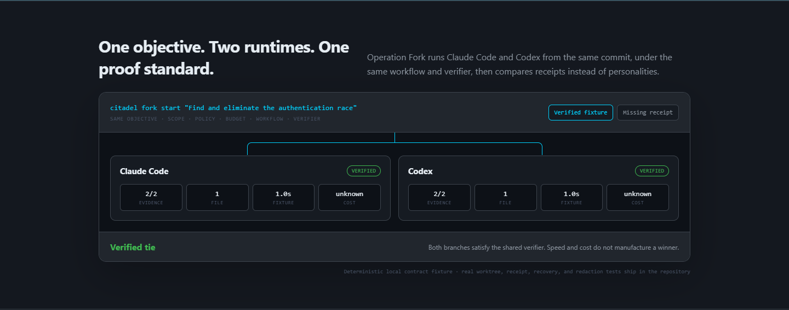
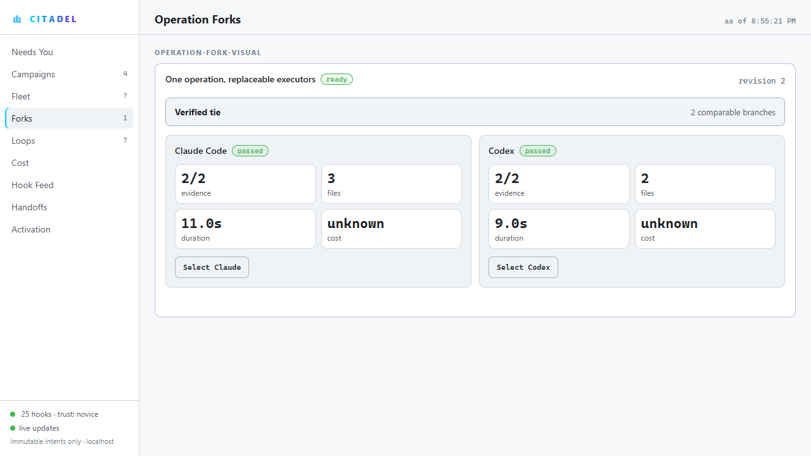
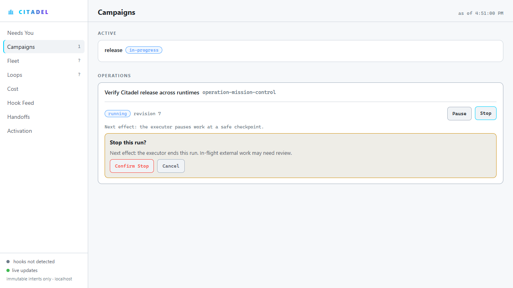

<div align="center">

[](LICENSE)
[](https://github.com/SethGammon/Citadel/actions/workflows/tests.yml)

[](https://github.com/SethGammon/Citadel/stargazers)
[](https://www.claudepluginhub.com/plugins/sethgammon-citadel)
[](https://sethgammon.github.io/Citadel/)

**One command routes the work. One operation can outlive any agent.**

Citadel is the open-source, runtime-neutral operations layer for Claude Code and OpenAI Codex. It adds durable project memory, cheap intent routing, verification evidence, cost telemetry, and coordinated agents in isolated git worktrees.

If `CLAUDE.md` and `AGENTS.md` tell the runtime **what** your project is, Citadel tells the runtime **how** to operate on it.

[Install](#quick-install) · [Fork an operation](#run-one-objective-through-both-runtimes) · [See the operating loop](#see-the-operating-loop) · [Inspect the proof](#proof-not-promises) · [Choose the right tool](docs/CHOOSING_CITADEL.md)

</div>

---

## See the operating loop



The animation summarizes a real contract: route the request, run the lightest capable workflow, verify the result, write the handoff, and preserve the next action in the repository. Run the [copyable workflow](DEMO.md) to reproduce it in your own project.

After installing, try this from your project root:

```text
/do setup --express
/do next
/do review README.md
/do generate tests for the changed files
/cost
```

## Proof, not promises

| Proof | Result | Inspect it |
|---|---:|---|
| Serialized landing lane | 15 of 15 PRs merged and deployed, 14 branch updates, 59 CI waits, 0 repair tasks | [Public proof repository](https://github.com/SethGammon/agents-md-deploy-steward-proof) |
| Hosted operating journey | 30 of 30 deterministic Claude Code and Codex journeys across Windows, Linux, and macOS | [Golden path](docs/GOLDEN_PATH.md) |
| Missing evidence | Absent telemetry stays `unknown` instead of becoming a green check | [Dashboard contract](docs/DASHBOARD_SPEC.md) |
| Fresh-process continuity | Campaign state and the next action reload from repository files | [Campaigns](docs/CAMPAIGNS.md) |
| Runtime replacement | One immutable operation produces isolated Claude Code and Codex branches, signed receipts, and an evidence-bound comparison | [Operation Fork](docs/OPERATION_FORK.md) |

These are bounded claims. Deterministic fixtures are not human adoption, clone operations are not retained users, and Citadel does not replace review.

### Help measure real use

If Citadel has run a real task in your repository, one local command creates a reviewable, redacted cohort bundle:

```sh
node .citadel/scripts/activation-telemetry.js share
```

Nothing is transmitted. The bundle contains only an opaque ID, observation age, version, bounded journey outcomes, and explicit aggregate consent. Post it only if you choose to. The public [activation cohort](docs/PRODUCT_PROOF_TRIAL.md) is targeting 25 shared installations, 40% verified handoff, 25% resume, and 15% seven-day return before Citadel claims retained human use.

## Run one objective through both runtimes

Citadel 1.3 introduces Operation Fork. Give Citadel one objective and it creates
isolated Claude Code and Codex worktrees from the same commit, runs both under the
same contract, verifies both, then shows what the evidence actually supports.

```text
citadel fork start "Find and eliminate the authentication race"
citadel fork status fork-find-and-eliminate-the-authentication-race
citadel fork compare fork-find-and-eliminate-the-authentication-race
```

The first command is enough to run the journey. Its built-in verifier uses
`git diff --check`. Pass `--workflow FILE` when the project needs stronger steps
and checks. If a process ends, `citadel fork resume ID` reloads the private
objective and workflow from durable local state.



The comparison is intentionally conservative. Missing receipts or verifier
evidence remain `unknown`. Equal verified outcomes remain a tie. Selection records
an operator decision but does not touch code. Landing is a separate command that
rechecks the fork revision, selected receipt, target commit, clean worktree, and an
exact confirmation token before a local merge.

Mission Control reads that canonical state directly and keeps the two branches,
the evidence boundary, and the selection boundary visible at once:



```text
citadel fork select ID --branch branch-codex --expected-revision 6 --idempotency-key choose-codex-001
citadel fork land plan ID
citadel fork land apply ID --expected-revision 7 --target-revision SHA --confirm TOKEN --idempotency-key land-codex-001
citadel fork replay ID --output operation-fork-replay.json
```

The replay is safe to share because it contains contract and artifact digests,
states, metrics, and the decision outcome, not prompts, source, paths, repository
identity, credentials, reasons, raw revisions, or signing keys. See the complete
[Operation Fork contract](docs/OPERATION_FORK.md).

## From outcome Pack to verifiable proof

Citadel 1.2 turned the operating loop into a portable contract. Pick an outcome Pack, create a
durable journey, then verify the receipt without trusting a dashboard or a chat transcript.

```text
citadel pack inspect ci-recovery
citadel journey start --run-id run-ci-recovery --pack ci-recovery --runtime codex --project .
citadel receipt verify --input .planning/operations/run-ci-recovery/receipt.json
```

| Layer | What ships | Trust boundary |
|---|---|---|
| **Outcome Packs** | CI recovery, migration campaign, and release steward workflows with strict permissions and dependencies | Local inspection and certification do not pretend to be marketplace trust |
| **Operations Protocol v0.1** | Typed specs, runs, attempts, intents, evidence, and receipts across local, Codex, and GitHub targets | Missing or incomplete evidence stays `unknown` |
| **Mission Control** | Pause, resume, stop, retry, and compare runtime forks through typed local actions | Localhost, exact origin, process nonce, capability, and revision checks |
| **Proof ledger** | Deterministic public projections of passed, failed, blocked, and unknown outcomes | Independent claims require an external pinned trust root |



The package CLI and provenance workflow are release-ready in this repository. Registry publication,
outside Pack authors, and independent adoption remain explicit external milestones.

## What Is Citadel?

Citadel turns one-off coding-agent chats into repeatable engineering workflows. Claude Code and Codex are strong at local reasoning and code edits, but each session still needs project context, safe operating rules, task routing, and a way to continue work after context resets. Citadel is that harness layer.

| | Claude Code / Codex alone | With Citadel |
|---|---|---|
| **Project context** | Re-explained every session | Compiled memory in repo-local `.planning/` files |
| **Choosing a workflow** | You pick review vs. debug vs. refactor | `/do` routes plain English to the lightest capable tool |
| **Long-running work** | Dies with the context window | Campaigns persist, resume, and hand off across sessions |
| **Parallel work** | Manual branch juggling | Fleet agents in isolated worktrees with shared discoveries |
| **Safety rules** | Prompt discipline, re-stated by hand | Lifecycle hooks enforce file protection and quality gates |
| **Token spend** | Guesswork | `/cost` and `/dashboard` from runtime-native telemetry |

## Quick Install

**Prerequisites:** Claude Code or OpenAI Codex, Node.js 18+, and a git repository you want Citadel to manage.

Open your project in Claude Code or Codex and paste this install prompt:

```text
Install Citadel in this repository.

Use https://github.com/SethGammon/Citadel as the source. If a local clone
already exists, reuse it or update it. Detect whether this session is running
in OpenAI Codex or Claude Code. From this project's root, run the matching
Citadel installer and follow any printed plugin enable step.

After Citadel is enabled in a fresh thread, run:

/do setup --express

Use the current repository as the target project. Do not require placeholder
path edits.
```

> [!IMPORTANT]
> After the installer finishes, start a **fresh session** if the runtime asks for one, then run `/do setup --express`. That is the command that matters: it auto-detects the project, installs hooks, scaffolds Citadel state, and gets you to a working `/do` without a tour.

<details>
<summary><strong>Manual install</strong> (run the installer yourself)</summary>

<br>

Clone Citadel once:

```bash
git clone https://github.com/SethGammon/Citadel.git ~/Citadel
```

Then run exactly one installer from the target project root.

For OpenAI Codex:

```bash
node ~/Citadel/scripts/install.js --runtime codex --add-marketplace
```

For Claude Code:

```bash
node ~/Citadel/scripts/install.js --runtime claude --install --scope local
```

Then start a fresh session in the same project and run:

```text
/do setup --express
```

</details>

> [!TIP]
> For a copyable first-run walkthrough, see [DEMO.md](DEMO.md). For runtime-specific details, dry runs, and troubleshooting, see [INSTALL.md](INSTALL.md).

## How It Works

Say what you want. `/do` routes it to the lightest workflow that can handle it.


Classification cascades through four tiers, cheapest first:

- **Tier 0 · Pattern match** - catches trivial commands with regex. Zero tokens, under a millisecond.
- **Tier 1 · Active state** - checks whether you are mid-campaign and resumes it.
- **Tier 2 · Keyword table** - routes known task language to installed skills. Still zero tokens.
- **Tier 3 · LLM classifier** - only when tiers 0-2 miss: analyzes complexity and picks Skill, Marshal, Archon, or Fleet.

Most requests resolve before Tier 3. Whatever runs, the same loop closes around it:



## Orchestration Ladder

Four tiers let Citadel scale from a one-line edit to a multi-session campaign. You never pick one; the router does.

<table>
<tr>
<td width="50%"></td>
<td width="50%"></td>
</tr>
<tr>
<td width="50%"></td>
<td width="50%"></td>
</tr>
</table>

## Core Features

| Capability | What you get | Docs |
|---|---|---|
| **Durable memory** | Campaigns, discoveries, intake, and telemetry live in `.planning/`, so work resumes after a fresh thread or context reset | [Campaigns](docs/CAMPAIGNS.md) |
| **`/do` routing** | Describe the task once; pattern, state, and keyword tiers resolve most requests for zero tokens | [Routing preview](docs/ROUTING_PREVIEW.md) |
| **Safety hooks** | <!-- GENERATED: hook-script-count -->35<!-- /GENERATED --> Node hook scripts across <!-- GENERATED: hook-event-count -->29<!-- /GENERATED --> lifecycle events protect files, gate risky actions, and record handoffs | [Hooks](docs/HOOKS.md) |
| **Cost telemetry** | `/cost` and `/dashboard` show real token usage and session spend instead of guesses | [Reports](docs/REPORT_ARTIFACTS.md) |
| **Product evidence** | Local activation stages and authenticated GitHub traffic snapshots separate attention and discovery sources from verified use without hosted analytics | [Activation metrics](docs/ACTIVATION_METRICS.md) |
| **Operations Protocol** | Six strict contracts, durable journals, recovery, receipts, and a conformance runner make work portable and inspectable | [Protocol](docs/OPERATIONS_PROTOCOL.md) |
| **Operation Fork** | Run one objective through Claude Code and Codex in isolated worktrees, compare signed evidence, select without merging, and export a redacted replay | [Operation Fork](docs/OPERATION_FORK.md) |
| **Outcome Packs** | Three first-party Packs package useful journeys with permissions, dependencies, stopping conditions, and proof | [Packs](docs/PACKS.md) |
| **GitHub verification Action** | A narrow read-only Action runs a declared workflow and emits an honest Operations Protocol receipt | [Action](docs/ACTION.md) |
| **Golden-path verification** | A hosted 30/30 Claude/Codex × Windows/Linux/macOS fixture grid proves install, setup, route, verification, handoff, resume, and exact rollback while labeling human evidence separately | [Golden path](docs/GOLDEN_PATH.md) |
| **Actionable Mission Control** | Ten schema-1 views plus authorized operation controls and runtime-fork selection; missing data stays `unknown`, never false green | [Dashboard spec](docs/DASHBOARD_SPEC.md) |
| **Product benchmark** | Ten frozen bare-versus-harnessed scenarios preserve symmetric inputs, raw runs, negative results, and an explicit open utility gate | [Benchmark](docs/BENCHMARK.md) |
| **Skill interoperability** | A digested external `SKILL.md` fixture installs unchanged under Claude and Codex projections, routes, verifies, emits local telemetry, hands off, and rolls back | [Interoperability](docs/INTEROPERABILITY.md) |
| **Operator console** | `/do next` is a decision-first cockpit: current state, next action, risk boundary, verification profile | [Operating loop](docs/OPERATING_LOOP_PROOF.md) |
| **Parallel fleets** | Broad work decomposes across agents in isolated worktrees, with discoveries shared between waves | [Fleet](docs/FLEET.md) |
| **Skills** | <!-- GENERATED: skill-count -->49<!-- /GENERATED --> built-in skills covering review, refactor, tests, QA, telemetry, and setup; write your own in one file | [Skills](docs/SKILLS.md) |
| **Repeatable setup** | Runtime-specific installers plus `/do setup --express` produce the same project state on Codex and Claude Code | [Install](INSTALL.md) |

## Why Citadel Exists

Claude Code and Codex made local agentic development practical. The next problem is operational: making those agents reliable across real projects, repeated sessions, and larger tasks. Without a harness, you keep solving the same coordination problems by hand:

- Re-explaining architecture and project conventions in every session.
- Choosing between review, debugging, refactor, test generation, or planning workflows yourself.
- Losing decisions and discoveries when context compresses or a session ends.
- Manually splitting large tasks across branches or worktrees.
- Rebuilding safety rules, cost checks, and handoff discipline in prompts.

Citadel adds the missing layer around the runtime: persistent state, intent routing, lifecycle enforcement, telemetry, and coordinated multi-agent execution. The priority is reliability over novelty: easier to install, easier to verify, harder to misuse.

## Built in the Open

Everything described above ships in this repository:

- <!-- GENERATED: skill-count -->49<!-- /GENERATED --> skills under [`skills/`](skills/), hook source under [`hooks_src/`](hooks_src/), runtime adapters under [`runtimes/`](runtimes/), installers and verification under [`scripts/`](scripts/).
- Trust boundaries are documented in [SECURITY.md](SECURITY.md) and [THREAT_MODEL.md](THREAT_MODEL.md): local automation risk, generated state, hooks, approval gates, and public-artifact review.
- The [loop contract](docs/LOOP_CONTRACT.md) makes repeated agent workflows inspectable, with shared budgets, verifiers, and stop conditions.
- CI runs the full local verification suite on every push. Run it yourself from a clone:

```bash
npm test
```

## Roadmap

The full plan with exit criteria lives in [docs/ROADMAP.md](docs/ROADMAP.md). The arc is now to make operations portable across runtimes, prove outcomes honestly, and keep every consequential action under operator control.

- **See It:** the read-only local dashboard now projects nine versioned views with explicit source health. Its 1,000-file CI gate enforces <1 second cold start, <500 ms updates, <64 MB complete RSS, and <10 MB dashboard overhead. Pixel baselines and stranger comprehension remain open gates. See [docs/DASHBOARD_SPEC.md](docs/DASHBOARD_SPEC.md).
- **Prove It:** the reproducible benchmark contract now freezes ten symmetric bare-versus-harnessed scenarios and publishes its negative fixture result. Actual runs and external scenario selection remain open. See [docs/BENCHMARK.md](docs/BENCHMARK.md).
- **Drive It:** typed pause, resume, stop, and retry controls now use the same immutable intent contract as the MCP server. Multi-operator approvals remain an external team gate.
- **Harden It:** durable journals, deterministic recovery, receipt signatures, team policy, and strict release provenance now ship locally. Representative real-run reliability evidence remains open.
- **Multiply It:** the Pack alpha, three first-party Packs, conformance tooling, and local Relay seam are built. Outside authors, a hosted signed registry, a third runtime adapter, and Relay demand remain explicit external gates.

## Learn More

- [Install and first run](INSTALL.md) - setup, first-run paths, and troubleshooting for both runtimes
- [Demo workflow](DEMO.md) - copyable operating-loop demo for a real repo
- [Interactive routing demo](https://sethgammon.github.io/Citadel/) - watch the tier cascade animate
- [Lab report: 103 days in](docs/LAB_REPORT.md) - the real numbers, what the platforms absorbed, and what survived
- [Routing preview guide](docs/ROUTING_PREVIEW.md) - compare Skill, Marshal, Archon, and Fleet before heavier work
- [Skills reference](docs/SKILLS.md) - all built-in skills with invocation and examples
- [Hooks reference](docs/HOOKS.md) - lifecycle events and enforcement behavior
- [Campaign guide](docs/CAMPAIGNS.md) - persistent state, phases, and handoffs
- [Fleet guide](docs/FLEET.md) - parallel agents, worktree isolation, discovery relay
- [Operating loop proof](docs/OPERATING_LOOP_PROOF.md) - evidence checklist for demos and PRs
- [Activation and acquisition metrics](docs/ACTIVATION_METRICS.md) - local funnel privacy, GitHub traffic history, and honest interpretation
- [Golden path verification](docs/GOLDEN_PATH.md) - deterministic runtime fixtures, cross-OS matrix rules, and human-proof boundaries
- [Product benchmark](docs/BENCHMARK.md) - frozen methodology, raw fixture evidence, negative results, and remaining real-run gates
- [Activation cohort](docs/PRODUCT_PROOF_TRIAL.md) - one-command opt-in bundle, explicit denominators, decision thresholds, and seven-day return protocol
- [Operations Protocol](docs/OPERATIONS_PROTOCOL.md) - contracts, compatibility, conformance, and privacy boundaries
- [Outcome Packs](docs/PACKS.md) - manifests, permissions, dependency safety, journeys, and certification
- [GitHub verification Action](docs/ACTION.md) - bounded inputs, receipts, and least-privilege usage
- [External milestone gates](docs/EXTERNAL_MILESTONE_GATES.md) - machine-readable thresholds that cannot be satisfied by fixtures
- [Reliability learning](docs/RELIABILITY_LEARNING.md) - consented dataset sufficiency, held-out evidence, and non-automatic recommendations
- [Interoperability](docs/INTEROPERABILITY.md) - external skill compatibility, provenance limits, and remote registry boundaries
- [Citadel 1.1 product-proof scorecard](docs/PRODUCT_PROOF_REPORT.md) - what is locally proven, CI-proven, human-proven, and still blocked
- [Skill and memory visibility](docs/SKILL_MEMORY_VISIBILITY.md) - inspect available skills and compiled project memory
- [Public positioning](docs/PUBLIC_POSITIONING.md) - how to describe Citadel without overclaiming
- [Choosing Citadel](docs/CHOOSING_CITADEL.md) - an honest comparison with Superpowers, CrewAI, LangChain, LangGraph, and Deep Agents
- [Security model](SECURITY.md) - path traversal, shell injection, and defensive measures
- [Contributing](CONTRIBUTING.md) - issues, PRs, skills, and docs

## FAQ

<details>
<summary><strong>Is this for me?</strong></summary>

<br>

If you use Claude Code or Codex on a real repository and keep hitting context loss, repeated setup, weak handoffs, or manual coordination overhead, yes. Citadel is most useful once you have repeated workflows.

</details>

<details>
<summary><strong>How is this different from <code>CLAUDE.md</code> or <code>AGENTS.md</code>?</strong></summary>

<br>

Those files describe your project. Citadel adds the operating layer around the agent: routing, memory, hooks, telemetry, and parallel coordination.

</details>

<details>
<summary><strong>How is Citadel different from Superpowers, CrewAI, or LangGraph?</strong></summary>

<br>

Citadel operates Claude Code and Codex inside an existing repository. Superpowers supplies a disciplined development methodology and can run alongside Citadel. CrewAI, LangChain, and LangGraph are for building your own agent applications or runtimes. See [Choosing Citadel](docs/CHOOSING_CITADEL.md) for the honest boundaries and cases where another tool is the better fit.

</details>

<details>
<summary><strong>Do I need to learn all <!-- GENERATED: skill-count -->49<!-- /GENERATED --> skills?</strong></summary>

<br>

No. Use `/do` and describe what you want. Direct skill commands are available when you want explicit control.

</details>

<details>
<summary><strong>How much token overhead does it add?</strong></summary>

<br>

Skills cost zero when not loaded. Router tiers 0-2 are local checks; Tier 3 uses a small LLM classification only when needed. Use `/cost` to inspect real usage.

</details>

<details>
<summary><strong>Does it work on Windows?</strong></summary>

<br>

Yes. Hooks and scripts run on Node.js, and the Codex installer includes Windows readiness checks.

</details>

## Community

- [Help test Citadel 1.1](https://github.com/SethGammon/Citadel/discussions/182) - independent benchmark review, first-time-user trials, and return-use evidence
- [GitHub Discussions](https://github.com/SethGammon/Citadel/discussions) - questions, use cases, bugs, and workflow requests
- [X / Twitter](https://x.com/SethGammon) - project updates

### Star History

<a href="https://www.star-history.com/#SethGammon/Citadel&Date">
  <picture>
    <source media="(prefers-color-scheme: dark)" srcset="https://api.star-history.com/svg?repos=SethGammon/Citadel&type=Date&theme=dark" />
    <source media="(prefers-color-scheme: light)" srcset="https://api.star-history.com/svg?repos=SethGammon/Citadel&type=Date" />
    
  </picture>
</a>

### Contributors

<a href="https://github.com/SethGammon/Citadel/graphs/contributors">
  
</a>

## License

MIT
