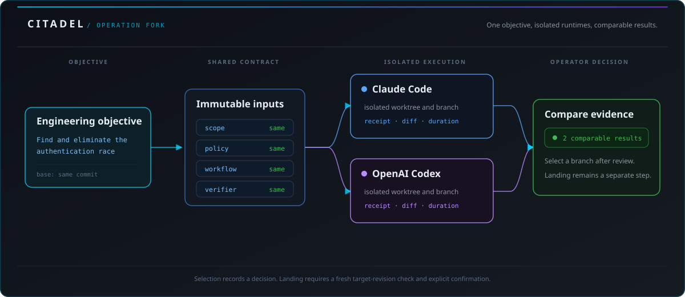

<div align="center">

[](https://github.com/SethGammon/Citadel/actions/workflows/tests.yml)
[](LICENSE)

[](https://sethgammon.github.io/Citadel/)

**An open-source operating layer for Claude Code and OpenAI Codex.**

Citadel helps coding agents work reliably across real repositories. It routes requests, preserves project state between sessions, coordinates parallel work, applies repository safeguards, and records verification and handoffs.

[Quick install](#quick-install) | [Start using it](#start-using-it) | [Is it a fit?](#when-citadel-is-useful) | [Portable operations](#portable-operations) | [Documentation](#choose-your-documentation)

</div>

## Quick install

**Requires:** Claude Code or OpenAI Codex, Node.js 18+, and a git repository.

Open the repository you want Citadel to manage, then paste this into your coding agent:

```text
Install Citadel from https://github.com/SethGammon/Citadel into this repository.
Detect whether I am using Codex or Claude Code, show me what will change before
applying it, use the current repository as the target, and run Citadel doctor.
```

Follow any printed enable step, start a fresh session if prompted, then run:

```text
/do setup --express
```

Setup installs the project hooks and creates the repo-local state Citadel uses to resume work later.

<details>
<summary><strong>Manual installation</strong></summary>

<br>

Clone Citadel once:

```bash
git clone https://github.com/SethGammon/Citadel.git ~/Citadel
```

From the repository you want Citadel to manage, run the installer for your runtime.

**OpenAI Codex**

```bash
node ~/Citadel/scripts/install.js --runtime codex --add-marketplace
```

**Claude Code**

```bash
node ~/Citadel/scripts/install.js --runtime claude --install --scope local
```

Start a fresh session in the same repository and run `/do setup --express`.

</details>

Dry runs, generated paths, runtime-specific setup, and rollback are documented in [Installation](INSTALL.md).

## Start using it



You do not need to learn the skill catalog or operation internals. Start with `/do` and describe the outcome:

```text
/do review README.md
/do generate tests for the changed files
/do next
```

Citadel reveals more machinery only when the work needs it:

| Level | Start here | What it gives you |
|---|---|---|
| 1. Do the work | `/do <request>` | Selects a proportional workflow and verifies the result |
| 2. Keep going | `/do next` or `/do continue` | Preserves and resumes work across sessions |
| 3. Coordinate | `/dashboard`, campaigns, or Fleet | Makes longer and parallel work visible and recoverable |
| 4. Control an operation | `citadel operation ...` | Adds explicit quality, privacy, tool, time, model-fallback, and cost constraints |

Most users can stay at Levels 1 and 2. Advanced levels do not replace or complicate `/do`.

For a copyable walkthrough in a real repository, use the [demo workflow](DEMO.md).

## When Citadel is useful

Citadel is most useful when coding-agent work extends beyond a single prompt:

| You are dealing with... | Citadel adds... |
|---|---|
| Repeated setup and lost context | Repo-local campaigns, decisions, discoveries, and handoffs |
| Unclear workflow choice | One natural-language entry point through `/do` |
| Risky or multi-step changes | Approval boundaries, lifecycle hooks, and explicit verification |
| Several agents or branches | Isolated worktrees, ownership, and shared discoveries |
| Work that must survive interruption | Durable state, recovery, and a concrete next action |

For a short, one-off edit, your coding agent may already be enough. Citadel becomes valuable when the operating discipline around the agent is the hard part.

Citadel does not replace `CLAUDE.md` or `AGENTS.md`. Those files describe the project and its rules. Citadel supplies the workflows and state used to carry them out consistently.

## What Citadel can prove

Citadel has repeatable local evidence for several engineering invariants and a
replayable public evaluation record. It does not yet have evidence for the
blanket claim that it makes every coding agent better.

| Evidence | Result | Boundary |
|---|---|---|
| Outside-authored public holdout | 24 distinct repositories, sealed routes, and 32 official verdicts. The controller verified 3/16 tasks versus 2/16 for direct Claude at 1.26% lower comparison cost. | Direct Claude verified only 12.5%, so the baseline was invalid. This is a diagnostic, not proof of reliability or savings. |
| Bounded hybrid pilot | Both policies verified 12/12 synthetic tasks. A local Qwen 3B support route used 38.7% less comparison cost than always-Claude. | One model pair, one machine, and author-selected tasks. Actual subscription cash and production generalization remain unknown. |
| Offline evidence replay | `npm run grant:verify` checks the signed artifacts, source bindings, receipt chains, reports, and public claims without calling a model. | Artifact integrity does not prove that an agent produced good work. |
| Deterministic recovery and safety A/Bs | Journaled recovery produced 0 duplicate effects versus 3 for naive restart across six injected boundaries. Safety gates achieved 100% malicious recall and 0% benign false positives across 12 matched decisions. | Local deterministic fixtures only. No process-kill, power-loss, real exploit, or cross-OS claim. |
| Leased deploy-steward state machine | Across three 15-PR batches per arm, independent loops produced 315 stale-head race attempts; the leased steward produced 0. | Fake provider only. This is not GitHub, Actions, branch-protection, or real-deployment evidence. |
| Protected GitHub deploy-steward A/B | Across three valid matched public runs, both policies merged 45/45 PRs through strict Actions checks and recorded exactly one successful GitHub Deployment per merge SHA. Independent loops incurred 106 failed merge races, 315 stale updates, and 421 interventions; the steward incurred 0 of each. | Six disposable public repositories under one account, plus one disclosed invalid run. Deployments are GitHub API records, not production releases. No speed, cost, human-utility, or broad reliability claim. |
| Lean installed distribution | The npm tarball is more than 5% smaller and contains 66 fewer files than the frozen baseline. Six installed CLI surfaces, 21 control-plane checks, and all 17 offline proof checks pass. | Source-only material remains in the repository and hash-accounted. One Windows and Node environment was measured. |

The public claim is deliberately narrow: Citadel can make agent evaluations
inspectable, reproducible, and fail-honest. Comparative real-user utility
remains open.

- [Evaluator start here](docs/grants/EVALUATOR_START_HERE.md)
- [Generated evidence manifest](docs/EVIDENCE_MANIFEST.md)
- [Experiment results, boundaries, and reproduction commands](docs/EXPERIMENTS.md)
- [Deploy-steward public case study](docs/CASE_STUDY_DEPLOY_STEWARD.md)
- [Public deploy control](https://github.com/SethGammon/citadel-steward-proof-20260804-control) and [steward treatment](https://github.com/SethGammon/citadel-steward-proof-20260804-treatment)
- [Outside-authored holdout](benchmarks/public-holdout-pilot/REPORT.md)
- [Bounded hybrid pilot](benchmarks/hybrid-economic-pilot-v2/published-run/REPORT.md)
- [Research site](https://sethgammon.github.io/Citadel/research.html)

## One operating loop



1. **Route:** `/do` chooses a focused skill, a coordinated session, a persistent campaign, or a parallel fleet.
2. **Execute and verify:** hooks apply repository rules, gate consequential actions, and capture required checks.
3. **Record and resume:** Citadel writes the result, handoff, and next action to the repository for the next session.

The repository remains the source of truth. Citadel adds an operating layer around the coding agent rather than replacing its runtime.

If you regularly delete clones, opt into [cross-clone repository memory](docs/REPOSITORY_MEMORY.md)
on Node.js 22.13+ with `citadel memory enable`. Citadel then keeps completed
campaigns, postmortems, research, discoveries, backlog, and project context in
a user-level SQLite database and restores missing files in another clone of the
same remote. Its default path is outside the checkout, and Citadel never commits,
pushes, or transmits it.

## Portable operations

Portable operations are optional. They are for work that needs a stable contract, durable recovery, comparable executors, or a verifiable receipt. Ordinary repository work still begins with `/do`.



| If you need to... | Start here |
|---|---|
| Run the same objective through isolated Claude Code and Codex branches | [Operation Fork](docs/OPERATION_FORK.md) |
| Package a repeatable result with permissions, checks, and stopping conditions | [Outcome Packs](docs/PACKS.md) |
| Inspect or control a running operation | [Mission Control](docs/DASHBOARD_SPEC.md) |
| Choose and escalate a model/tool/topology path under explicit constraints | [Operation Control](docs/OPERATION_CONTROL.md) |
| Adopt Citadel reversibly, activate only the needed product, or connect an external control plane | [Governed lifecycle](docs/GOVERNED_LIFECYCLE.md) |

The underlying [Operations Protocol](docs/OPERATIONS_PROTOCOL.md) defines the runtime-neutral contracts for operations, attempts, intents, evidence, and receipts. Most users do not need those internals to use Citadel.

For reviewers who want evidence instead of architecture claims, Operation
Control includes a [frozen 120-cell real-workload import](benchmarks/operation-control-v2/REPORT.md)
and a [preregistered real-runtime integration result](benchmarks/operation-control-v2/prospective/RESULTS.md).
Both preserve failed and unknown outcomes and state what they do not prove.

## Trust and scope

- Citadel runs with the permissions of Claude Code or Codex. It does not replace code review, branch protection, or repository-specific checks.
- Verification artifacts report `passed`, `failed`, `blocked`, or `unknown`. Missing evidence is not promoted to success.
- Project state and telemetry stay local by default. Nothing is transmitted automatically.
- The automated suite validates Citadel's contracts and supported fixtures. It does not guarantee the quality of an agent's code.

Read [Security](SECURITY.md), the [threat model](THREAT_MODEL.md), and [golden-path verification](docs/GOLDEN_PATH.md) for the full boundaries.

## Choose your documentation

| Goal | Recommended path |
|---|---|
| Install or evaluate Citadel | [Installation](INSTALL.md), [Demo](DEMO.md), [Choosing Citadel](docs/CHOOSING_CITADEL.md) |
| Operate day to day | [Campaigns](docs/CAMPAIGNS.md), [Fleet](docs/FLEET.md), [Hooks](docs/HOOKS.md), [Mission Control](docs/DASHBOARD_SPEC.md) |
| Use portable operations | [Operation Control](docs/OPERATION_CONTROL.md), [Operation Fork](docs/OPERATION_FORK.md), [Outcome Packs](docs/PACKS.md), [Recovery](docs/OPERATION_RECOVERY.md) |
| Govern adoption, activation, evidence, or external control | [Governed lifecycle](docs/GOVERNED_LIFECYCLE.md), [Real User Proof v2](docs/PRODUCT_PROOF_TRIAL.md) |
| Integrate or verify | [CLI reference](docs/CLI.md), [Interoperability](docs/INTEROPERABILITY.md), [Reports](docs/REPORT_ARTIFACTS.md) |

The complete reference is in [`docs/`](docs/).

<details>
<summary><strong>Project footprint</strong></summary>

<br>

The current package includes <!-- GENERATED: skill-count -->48<!-- /GENERATED --> workflows and <!-- GENERATED: hook-script-count -->35<!-- /GENERATED --> hook scripts across <!-- GENERATED: hook-event-count -->29<!-- /GENERATED --> lifecycle events. `/do` selects among them; they are not a prerequisite checklist.

Citadel keeps operational state separate from application code:

```text
.planning/                 Campaigns, operations, fleet sessions, intake, and telemetry
.citadel/scripts/          Project-local coordination and reporting utilities
.claude/agent-context/     Rules supplied to delegated agents
.claude/harness.json       Project configuration generated by setup
```

Runtime adapters may add Claude Code or Codex configuration files. [Installation](INSTALL.md) lists every generated path and its rollback procedure.

</details>

## Common questions

<details>
<summary><strong>Can I delete a clone without losing Citadel's lessons?</strong></summary>

<br>

Yes, if you enable cross-clone memory first with `citadel memory enable` on
Node.js 22.13+. It syncs only durable knowledge to a local user-level SQLite store.
A new clone with the same `origin` restores missing knowledge automatically
after Citadel is installed. Existing divergent files are never overwritten
automatically. See [Cross-clone repository memory](docs/REPOSITORY_MEMORY.md).

</details>

<details>
<summary><strong>Do I need to learn every skill or operation command?</strong></summary>

<br>

No. Start with `/do`. Operation commands are only for work that needs durable contracts, receipts, recovery, or runtime comparison.

</details>

<details>
<summary><strong>Does Citadel work on Windows?</strong></summary>

<br>

Yes. The hooks and scripts run on Node.js, and the Codex installer includes Windows-specific readiness checks.

</details>

<details>
<summary><strong>How do I remove it?</strong></summary>

<br>

Use `/unharness` to create a receipt-owned leave plan, review the exact
footprint, and apply it with the plan token. Legacy installs are inventoried
first and cannot claim exact removal. [Installation](INSTALL.md) documents the
rollback and compatibility paths.

</details>

## Community

- [GitHub Discussions](https://github.com/SethGammon/Citadel/discussions) for questions, use cases, and workflow requests
- [Contributing](CONTRIBUTING.md) for issues, pull requests, skills, and documentation
- [MIT License](LICENSE)
