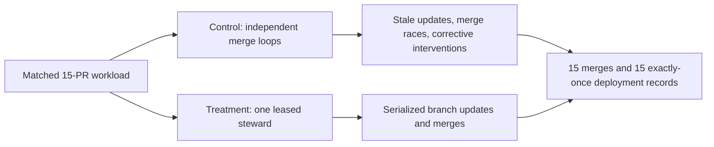

# Case study: one deploy steward versus independent merge loops

## Result in plain language

Citadel's leased deploy steward prevented competing merge workers from racing
each other in three matched public GitHub trials. Both approaches ultimately
merged every pull request and recorded every deployment. The difference was
coordination: the independent control loops repeatedly acted on stale branch
state and required scripted corrective interventions, while the steward
serialized the same work with none of those events.

This is evidence for one mechanism under one bounded workload. It is not proof
that Citadel makes every agent better or that it improves production deployment
speed, cost, or uptime.

## The experiment

Each valid run created two disposable public repositories with the same 15 pull
requests, branch protection, required GitHub Actions check, and GitHub Deployment
API recorder.

The primary measures were failed merge races, stale branch updates, corrective
interventions, repairs, completed merges, and exactly-once deployment records.
Arm order was counterbalanced across valid runs. Timing was recorded only as
descriptive operational telemetry because shared GitHub runner and API conditions
were not controlled.

## Observed results

| Run | Arm order | Control races | Control stale updates | Control interventions | Steward races | Steward interventions | Completion |
|---|---|---:|---:|---:|---:|---:|---|
| `proof-20260804` | control first | 34 | 105 | 139 | 0 | 0 | 30/30 PRs merged; 30/30 exactly-once deployment records |
| `proof-20260805-r2b` | treatment first | 47 | 105 | 152 | 0 | 0 | 30/30 PRs merged; 30/30 exactly-once deployment records |
| `proof-20260805-r3` | control first | 25 | 105 | 130 | 0 | 0 | 30/30 PRs merged; 30/30 exactly-once deployment records |
| **Valid-run total** | counterbalanced | **106** | **315** | **421** | **0** | **0** | **90/90 PRs merged; 90/90 exactly-once deployment records** |

The steward met the frozen comparative hypothesis in every valid run: fewer race
attempts than the control and no more interventions than the control. The result
supports a narrow causal explanation because the workload and repository policy
were matched, while the coordination policy was the intended difference.

## What failed and what changed

The first treatment-first repeat, `proof-20260805-r2`, is excluded. A transient
GitHub GraphQL error interrupted execution. On resume, the harness did not retain
the identity of merged pull requests whose head branches had already been
deleted, so it recreated ten pull requests. The run is disclosed as negative
integration evidence rather than counted as a successful repetition.

After explicit cleanup authorization, accidental PRs 16 through 25 were closed
with explanatory comments and duplicate branches `agent-01` through `agent-10`
were deleted. Original unfinished PRs 11 through 15 remain open as part of the
invalid run's historical record.

The resume logic now retains a recorded pull request after merge even when its
head branch no longer exists. A regression test reproduces that condition. The
replacement run `proof-20260805-r2b` completed against the unchanged frozen
contract.

## Inspect the evidence

- Baseline: [control repository](https://github.com/SethGammon/citadel-steward-proof-20260804-control), [steward repository](https://github.com/SethGammon/citadel-steward-proof-20260804-treatment), and [`live-github-result.json`](../benchmarks/citadel-proof-experiments/deploy-steward/live-github-result.json)
- Treatment-first replacement: [control repository](https://github.com/SethGammon/citadel-steward-proof-20260805-r2b-control), [steward repository](https://github.com/SethGammon/citadel-steward-proof-20260805-r2b-treatment), and [`live-github-result-r2b.json`](../benchmarks/citadel-proof-experiments/deploy-steward/live-github-result-r2b.json)
- Final control-first repeat: [control repository](https://github.com/SethGammon/citadel-steward-proof-20260805-r3-control), [steward repository](https://github.com/SethGammon/citadel-steward-proof-20260805-r3-treatment), and [`live-github-result-r3.json`](../benchmarks/citadel-proof-experiments/deploy-steward/live-github-result-r3.json)
- Aggregate and exclusion record: [`live-github-aggregate.json`](../benchmarks/citadel-proof-experiments/deploy-steward/live-github-aggregate.json) and [`live-github-invalid-r2.json`](../benchmarks/citadel-proof-experiments/deploy-steward/live-github-invalid-r2.json)
- Frozen method: [`live-github-contract.json`](../benchmarks/citadel-proof-experiments/deploy-steward/live-github-contract.json) and [`live-github-repeat-spec.json`](../benchmarks/citadel-proof-experiments/deploy-steward/live-github-repeat-spec.json)

## Claim boundary

These were public disposable repositories under one GitHub account. The workload
was generated by the harness, and deployments were GitHub Deployment API records
with success statuses, not production releases. The trials did not measure human
utility, production incidents, controlled latency, cash cost, or long-term
reliability. Those remain separate experiments.
