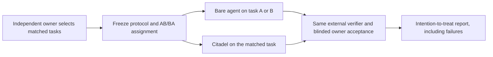

# External Owner Trial

Status: instrument ready; recruitment and external scenario selection not started.

This is the next claim-bearing product experiment after the local mechanism and
GitHub stewardship proofs. It asks whether Citadel helps real repository owners
complete their own work, not whether Citadel can pass its own fixtures.

## Claim under test

On externally selected matched tasks, Citadel is non-inferior on owner-accepted,
verified completion and either improves recovery or reduces corrective
interventions within bounded time overhead, with zero false passes.

The preregistered gates are already encoded by Real User Proof v2:

- accepted-completion paired lower bound at least -0.05;
- recovery gain at least 0.20 or corrective-intervention reduction at least 0.25;
- time overhead no more than 0.15;
- verification accuracy at least 0.95 and false passes equal to zero;
- telemetry join at least 0.95;
- meaningful, canonically verified D7 retention reported separately.

No individual pilot can satisfy those cohort gates.

## Participant and repository criteria

Each participant must:

1. own or maintain a repository that is independent of Citadel;
2. be able to define two distinct, matched, artifact-producing tasks that matter
   to that repository;
3. use the same runtime family, model identity, operating-system family, and
   verification standard in both arms;
4. consent to privacy-minimal aggregate reporting and retention of failures;
5. judge acceptance without being shown which aggregate outcome Citadel needs.

Exclude Citadel contributors, synthetic fixture repositories, tasks already used
to tune the harness, and tasks whose outcome cannot be checked independently.

## Design

The claim-bearing cohort uses deterministic, balanced AB/BA assignments. Each
owner completes one bare-agent assignment and one Citadel assignment on matched
but distinct tasks. The generated assignment commitment is frozen before any run.



Order, timeouts, abandonments, missing records, rejected outputs, setup failures,
and false passes remain in the intention-to-treat denominator. A retry is a
recorded intervention, not a replacement attempt.

## Privacy and evidence

Retain only the schema-validated Real User Proof v2 records and signed receipts.
Do not collect prompts, source code, repository paths, credentials, user identity,
or free-form transcripts in the public aggregate. Public cells smaller than five
remain suppressed. `share-preview` is local-only and never transmits data.

The repository owner keeps raw project material. Citadel records bounded status,
counts, digests, durations, model/runtime identity, verifier outcomes, and owner
acceptance. Missing evidence remains unknown.

## Operator sequence

After an owner supplies matched scenarios and consent, create the exact trial
specification and review it with them before starting:

```sh
node scripts/product-proof-trial.js validate --spec <owner-reviewed-spec.json>
node scripts/product-proof-trial.js plan --spec <owner-reviewed-spec.json>
node scripts/product-proof-trial.js start --spec <owner-reviewed-spec.json> --root <private-trial-root>
node scripts/product-proof-trial.js record --input <validated-record.json> --root <private-trial-root>
node scripts/product-proof-trial.js report --root <private-trial-root>
node scripts/product-proof-trial.js share-preview --root <private-trial-root>
```

The plan must be inspected before `start`. Each assignment uses the canonical
repository verifier selected before execution. Retention observations are recorded
only after elapsed D7 time and another meaningful verified task.

## Recruitment copy, not yet sent

> I am running a preregistered comparison of a bare coding agent and Citadel on
> real repository work. You would choose two matched tasks in a repository you
> own, review the frozen counterbalanced plan, and judge both outcomes using the
> same verification standard. Failures stay in the result. Public reporting is
> aggregate and privacy-minimal; prompts, source, paths, credentials, and identity
> are excluded. Participation does not require a positive result.

## Human gate

The next authorized action is not another fixture run. It requires a real,
independent repository owner who agrees to participate, selects the matched tasks,
approves the frozen plan, and supplies the owner-verdict evidence. Until then:

- `claim_status` remains `instrument_only`;
- `utility_claim` remains `false`;
- external selection, owner acceptance, and D7 retention remain unknown;
- the recruitment copy above remains unsent.

